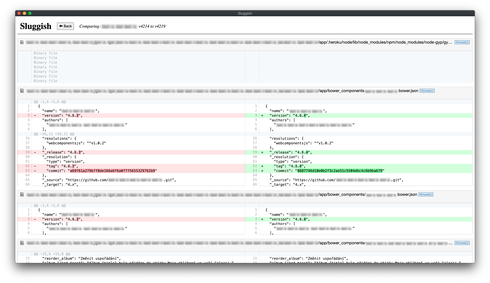

# sluggish _(Work in Progress)_

Compare two Slugs in Heroku.

_This app is named what it is because it analyzes heroku slugs **and** it is very slow._



## Setup and Install

### Prerequisites

This app relies on the `heroku` CLI and the `heroku-slugs` plugin. **You must be logged in for this tool to work**

On MacOS:

```sh
brew tap heroku/brew && brew install heroku;
heroku login;
```

Then:

```sh
heroku plugins:install heroku-slugs
```

### Running this app

_Disclaimer:_ Right now this product is a work in progress, so I have decided not to publish it as a full blown application. You can still install and run it, however, as you would any NPM application.

```
git clone https://github.com/kyle-west/sluggish;
cd sluggish;

npm install;
npm start;
```